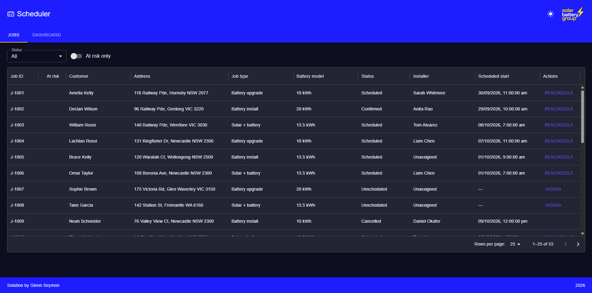
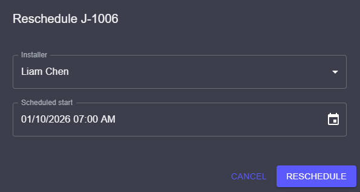
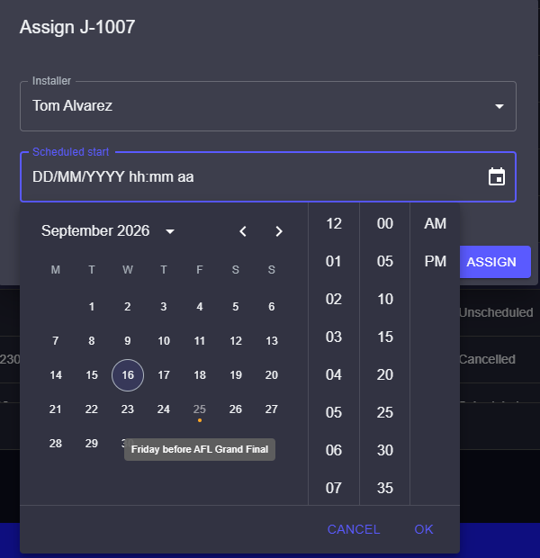
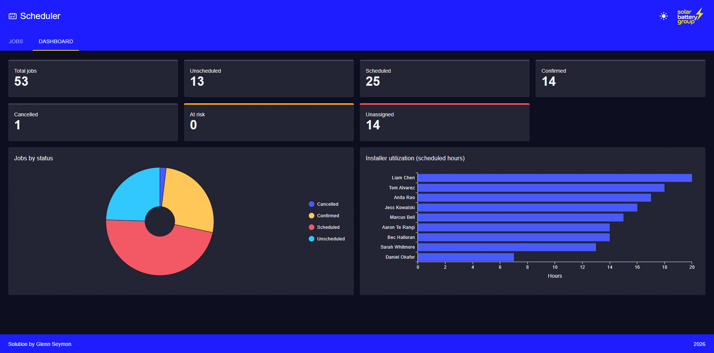
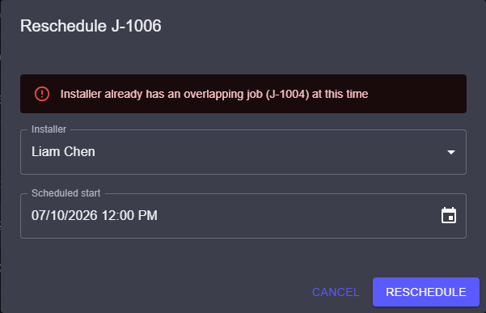
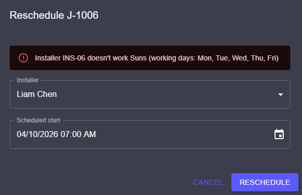

# SBGScheduler

An installer job scheduler for Solar Battery Group, replacing a spreadsheet-based workflow with a single
view of job status, installer availability, and weather-driven scheduling risk. Built as part of an
interview take-home. See [clientBrief.md](./clientBrief.md) for the original client brief.

## Features

- **Jobs data grid** — table of all jobs with column sorting, pagination, and a status filter
- **Assign / reschedule workflow** — dialogs (React Hook Form + shared Zod validation) to assign an
  unscheduled job to an installer and time, or reassign/reschedule an already-scheduled job
- **Scheduling rule engine** — rejects invalid assignments: double-booking, installer/job state mismatch,
  outside the installer's shift hours or working days (timezone-aware), during installer leave, or on a
  national/state public holiday (highlighted and unselectable in the assign/reschedule calendar)
- **At-risk flagging** — flags jobs with a bad weather forecast or unassigned jobs starting soon, with a
  filter and a tooltip explaining why
- **Live weather + geocoding** — Open-Meteo forecast (BOM ACCESS-G model) and geocoding, no API key
  required, cached to avoid hammering the API on every request
- **Dashboard** — summary cards (counts by status, at-risk, unassigned) and charts (jobs-by-status pie,
  installer utilisation by scheduled hours)
- **SBG branding** — palette derived from the Solar Battery Group logo, light/dark theme toggle
- **Snackbar notifications** — success/error feedback for assign and reschedule actions
- **Skeleton loaders** — loading states for the jobs grid (MUI X's default skeleton-row overlay) and the
  dashboard (summary cards + charts)
- **Unit tests** — Vitest coverage for the rule engine and at-risk calculation, plus the assign form's
  validation and the at-risk badge (React Testing Library), all runnable via `npm run test`; see
  [Future Release Plan](#future-release-plan) for e2e/component coverage not yet in scope
- **Error tracking** — Sentry for frontend (React error boundary) and backend (centralized error
  middleware), one shared project for both

## Tech Stack

| Layer               | Technology                                                                                                                                         |
| ------------------- | -------------------------------------------------------------------------------------------------------------------------------------------------- |
| Frontend            | React (Vite) + TypeScript, Material UI + MUI X DataGrid/Charts, Tanstack Query, React Hook Form, Axios                                             |
| Backend             | Node.js + Express + TypeScript                                                                                                                     |
| Shared              | Zod schemas + inferred TS types, imported by both frontend and backend so validation is written once                                               |
| Database            | PostgreSQL (Neon), Prisma ORM                                                                                                                      |
| Weather & geocoding | [Open-Meteo](https://open-meteo.com/) forecast + geocoding APIs — free, keyless                                                                    |
| Public holidays     | [Nager.Holidays](https://nagerholidays.com) API — free, keyless                                                                                    |
| Testing             | Vitest (unit test runner), React Testing Library (frontend components); Playwright (e2e) planned — see [Future Release Plan](#future-release-plan) |
| Error tracking      | Sentry                                                                                                                                             |
| Hosting             | Vercel — frontend static build + backend as serverless functions under `/api`                                                                      |
| Tooling             | npm workspaces, ESLint (flat config, typescript-eslint), Prettier                                                                                  |

## Prerequisites

- Node.js 24+ and npm
- A [Neon](https://neon.tech) Postgres project (or any Postgres connection string)
- No API keys needed — Open-Meteo's weather/geocoding and Nager's public holidays APIs are all free and
  keyless

## Getting Started

**1. Clone and install dependencies**

```bash
git clone https://github.com/GlennSeymon/SBGScheduler.git
cd SBGScheduler
npm install
```

**2. Configure environment variables**

```bash
cp .env.example .env.local
```

Edit `.env.local` and fill in your Neon connection strings (both the pooled and direct/unpooled variants —
Prisma Migrate needs the direct one, since Neon's pooled connection doesn't support the advisory locks it
uses):

```
DATABASE_URL="postgresql://...-pooler.../neondb?sslmode=require"
DATABASE_URL_UNPOOLED="postgresql://.../neondb?sslmode=require"
PORT=3001
```

**3. Set up the database**

```bash
npm run db:migrate --workspace=backend   # apply Prisma migrations to Neon
npm run db:seed --workspace=backend      # seed from candidatepack_SBG/candidate/*.csv
```

**4. Run the dev servers**

```bash
npm run dev   # shared (watch build), backend, and frontend concurrently
```

Frontend: http://localhost:5173 (proxies `/api/*` to the backend)
Backend: http://localhost:3001

> **On WSL2**: the backend disables Node's Happy Eyeballs address racing (`net.setDefaultAutoSelectFamily(false)`
> in `backend/src/index.ts`) — WSL2's virtual network adapter otherwise makes Node's own IPv4 connection
> attempts to some dual-stack hosts (Open-Meteo's geocoding API, notably) time out even though the same IP
> connects fine via `curl`, which silently breaks weather/geocoding lookups (no job ever shows as at-risk)
> without erroring. Not needed outside WSL2, but harmless there either way.

**5. Build / lint / test**

```bash
npm run build # build shared, then backend, then frontend, in that order
npm run lint  # lint all three workspaces
npm run test  # run backend + frontend unit tests (Vitest)
```

## Project Structure

```
SBGScheduler/
├── shared/            # Zod schemas + inferred types (@sbg/shared), used by frontend and backend
├── backend/
│   ├── prisma/
│   │   ├── schema.prisma  # Installer/Job models, migrations against Neon
│   │   └── seed.ts        # Seeds Neon from candidatepack_SBG/candidate/*.csv
│   └── src/
│       ├── index.ts    # Express entry point
│       ├── lib/         # Prisma client, rule engine, Open-Meteo geocoding/weather, at-risk calc,
│       │                # Nager public holidays
│       ├── middleware/  # Centralized error handling
│       └── routes/      # installers, jobs (list, assign, reschedule), public-holidays
├── frontend/
│   └── src/           # Vite + React app
├── candidatepack_SBG/ # Sample jobs.csv / installers.csv + data dictionary for seeding
├── vercel.json        # Vercel Services config — backend under /api, frontend serves everything else
└── .env.example
```

## Job Lifecycle

```
Unscheduled job
        │
        ▼
  Agent assigns installer + start time
        │
        ▼
  Rule engine checks: no double-booking, shift hours/working days,
  installer leave, installer/job state match, not a public holiday
        │
        ├─── Violates a rule → rejected, reason shown inline
        │
        └─── Passes → status: Scheduled
                │
                ▼
          Status: Confirmed (or Cancelled)
                │
                ▼
          "At risk" flag applied if: bad weather forecast for the site,
          OR job is unassigned and starting soon
```

## Scheduling Rule Engine

`backend/src/lib/rule-engine.ts` runs six independent checks against a proposed assign/reschedule; any
violation blocks the booking and returns a reason shown inline in the assign/reschedule dialog. All checks
run (not short-circuited), so a booking can fail for more than one reason at once.

| Rule             | Blocks a booking when…                                                                                                                                                                                                       |
| ---------------- | ---------------------------------------------------------------------------------------------------------------------------------------------------------------------------------------------------------------------------- |
| `STATE_MISMATCH` | The installer's `state` doesn't match the job's `state` — installers don't cross state lines                                                                                                                                 |
| `OUTSIDE_SHIFT`  | The job's start day (in the installer's state timezone) isn't one of the installer's `workingDays`, or the job's start/end time falls outside `shiftStart`–`shiftEnd`, or the job would run past shift end into the next day |
| `ON_LEAVE`       | The job's local calendar date falls within the installer's `leaveStart`–`leaveEnd` (inclusive)                                                                                                                               |
| `DOUBLE_BOOKING` | The job's time interval overlaps another job already assigned to the same installer                                                                                                                                          |
| `PUBLIC_HOLIDAY` | The job's local calendar date is a national public holiday, or a state public holiday for the job's own state (per [Nager.Holidays](https://nagerholidays.com))                                                              |
| `IN_PAST`        | The job's `scheduledStart` is earlier than the current time — also enforced in the UI via the assign/reschedule date picker's `minDateTime`                                                                                  |

Each state keeps its own IANA timezone (`STATE_TIME_ZONES`) for these comparisons — e.g. `QLD` doesn't
observe daylight saving, so a shift/holiday boundary at the same wall-clock time can differ from `NSW`.
See `tech-stack.md` → Timezone handling for the full rationale.

## API

All endpoints are prefixed `/api/`. The Vite dev server proxies `/api/*` to the backend, so no CORS
configuration is required in development.

| Method  | Path                       | Description                                                                                                | Status |
| ------- | -------------------------- | ---------------------------------------------------------------------------------------------------------- | ------ |
| `GET`   | `/api/health`              | Health check — confirms the API and Neon DB are reachable                                                  | Live   |
| `GET`   | `/api/installers`          | List installers                                                                                            | Live   |
| `GET`   | `/api/jobs`                | List jobs (all fields, including the at-risk flag/reasons)                                                 | Live   |
| `PATCH` | `/api/jobs/:id/assign`     | Assign an unscheduled job to an installer + start time, enforcing scheduling rules (incl. public holidays) | Live   |
| `PATCH` | `/api/jobs/:id/reschedule` | Change time and/or installer on a scheduled job, enforcing scheduling rules (incl. public holidays)        | Live   |
| `GET`   | `/api/public-holidays`     | List national + state public holidays for the current and next calendar year                               | Live   |

## Integrations

Both integrations below are free, keyless third-party APIs, called from the backend and cached in-memory
(`backend/src/lib/ttl-cache.ts`) to avoid re-hitting the provider on every `/api/jobs` poll. A failed
computation is never cached, so a transient outage is simply retried on the next call rather than sticking
around for the rest of the TTL window.

### Weather & geocoding

Job sites are geocoded and forecast via [Open-Meteo](https://open-meteo.com/), used to power the "at-risk"
weather flag:

- **Geocoding** (`backend/src/lib/geocoding.ts`) — resolves a job's suburb + state to lat/lon via
  Open-Meteo's geocoding API, preferring an exact suburb name match and disambiguating suburbs that recur
  across states (e.g. Richmond in both NSW and VIC) by matching on the expected state. Cached for 1 day per
  suburb, since a suburb's coordinates don't change.
- **Forecast** (`backend/src/lib/weather.ts`) — fetches up to 16 days of daily forecast (weather code,
  precipitation probability/sum, max wind speed) from Open-Meteo's forecast API. Requests the
  `bom_access_global` model first, for a genuinely BOM/ACCESS-G sourced forecast, and automatically falls
  back to Open-Meteo's default best-match model if BOM's feed comes back empty — which it currently does,
  as BOM's open-data delivery is suspended for platform upgrades as of 2026-09-15. Each forecast entry
  records which model actually supplied it (`source: 'bom_access_global' | 'best_match'`). Cached for 30
  minutes per coordinate. `GET /api/jobs` fetches every distinct job suburb's forecast in a single batched
  Open-Meteo request (`getForecasts`) rather than one request per suburb, with a retry-with-backoff on
  `429`s as a backstop — avoids bursting the rate limit on a job list spanning many suburbs.

### Public holidays

National and state public holidays come from the [Nager.Holidays](https://nagerholidays.com) API
(`backend/src/lib/public-holidays.ts`), used both to render the holiday calendar and to block scheduling
a job on a day the assigned installer's state observes as a public holiday. Fetches Australia's public
holidays (filtered to `holidayTypes: Public`) for a given year, normalising Nager's ISO 3166-2 subdivision
codes (e.g. `AU-VIC`) down to our state enum — a holiday with no subdivisions is treated as national
(applies to every state), distinct from one whose subdivisions are all unrecognised. Cached for 1 day per
year, since a year's holiday calendar is effectively immutable once published.

## Screenshots

### Jobs grid

Sortable, paginated table of all jobs with a status filter and an at-risk toggle.



### Reschedule dialog

Reassigning the installer and/or start time on an already-scheduled job.



### Assign dialog with datetime picker filtered with public holidays

Assigning an unscheduled job to an installer and start time — the calendar highlights and blocks
national and state public holidays.



### Dashboard

Summary cards (counts by status, at-risk, unassigned) alongside jobs-by-status and installer
utilisation charts.



### Reschedule dialog — double-booking rejected

The rule engine blocks a reschedule that would double-book the installer, with the reason shown inline
in the dialog and as a snackbar.



### Reschedule dialog — outside working days rejected

The rule engine blocks a reschedule that falls on a day the installer doesn't work.



## Future Release Plan

Out of scope for this take-home's deadline, but what a follow-up iteration would consider next:

- **Playwright e2e coverage** — assign happy path, reschedule happy path, and at-risk filter, exercising
  the full stack (frontend → API → Neon) rather than today's unit-level Vitest/RTL coverage.
- **Deeper component test suite** — Expand to cover more cases. Only the assign form and at-risk badge are covered today.
- **Server-side pagination** — `GET /api/jobs` currently returns every job in one response and the
  `DataGrid` paginates client-side, which is fine for this dataset but wouldn't scale; a production
  version would push pagination (and filtering/sorting) down to the API so the client never holds the
  full table in memory.
- **Authentication/authorization** — there's currently no login. At minimum a dispatcher role, and
  possibly a read-only installer view scoped to their own schedule.
- **Concurrency handling on assign/reschedule** — two dispatchers assigning different jobs to the same
  installer/slot at nearly the same time could both pass rule-engine validation before either write
  lands, since there's no optimistic locking or transaction-level re-check at write time.
- **Audit trail** — no history of who changed what and when on a job; useful for a scheduling tool where
  a customer or installer disputes a reschedule.
- **Calendar/timeline view** — the jobs grid is a flat table; a per-installer day/week calendar view
  would let a dispatcher spot scheduling gaps and conflicts visually, rather than scanning rows.
- **Customer/installer notifications** — job records already store phone/email but nothing sends a
  confirmation or reschedule notice today.
- **Map/travel-time-aware** — a map view was considered during scoping. Eligible
  installer distance and travel time should be considered rather than simply installer availability in the state.

## Deployed link

https://sbg-scheduler-theta.vercel.app

## Repo

https://github.com/GlennSeymon/SBGScheduler

## License

This project is licensed under the [MIT License](LICENSE).
